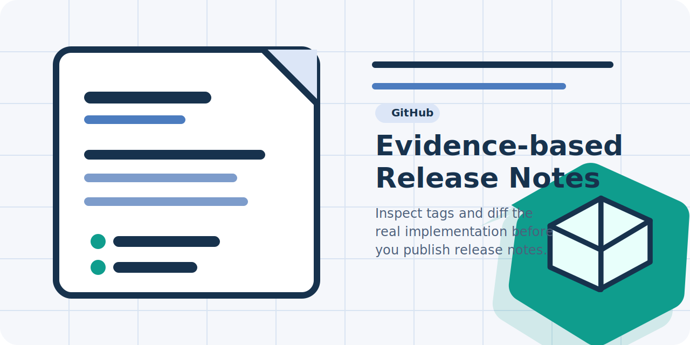

<div align="center">
  
  <h1>GitHub Release Notes Skill</h1>
  <p><strong>Codex skill for drafting and publishing GitHub release notes from real git diffs, tags, and validation evidence, or turning that same evidence into docs-backed article pages.</strong></p>
  <p>
    <a href="./README.ja.md">Japanese</a>
    |
    <a href="./SKILL.md">Skill Source</a>
    |
    <a href="./CONTRIBUTING.md">Contributing</a>
  </p>
  <p>
    
    
    
    <a href="./LICENSE"></a>
  </p>
</div>



GitHub Release Notes Skill helps Codex turn repository evidence into publishable GitHub release notes or docs-backed article pages. It packages a production-ready `SKILL.md`, a PowerShell context collector, reusable drafting references, and repository QA so release bodies and article pages stay grounded in actual diffs instead of thin commit summaries.

## Why This Repo

- Build release notes from real code changes, not `git log --oneline` alone.
- Handle both first releases and incremental tagged releases with the same workflow.
- Reuse the same release evidence to draft docs article pages when the user wants a blog or announcement post.
- Reuse an existing versioned release header SVG when the target repository already has one.
- Keep publication grounded in `gh release create`, `gh release edit`, and post-publish verification.
- Mirror release notes into repository docs by default when the target repository already publishes a docs site.
- Ship the skill with bilingual top-level docs and lightweight QA so the repository is ready to share.

## Quick Start

1. Confirm the required tools are available:

   ```powershell
   git --version
   gh --version
   gh auth status
   ```

2. Fetch the latest tags in the target repository if needed:

   ```powershell
   git fetch --tags --force
   ```

3. Run the bundled collector from this repository against the tag or target you want to describe:

   ```powershell
   powershell -ExecutionPolicy Bypass -File ./scripts/collect-release-context.ps1 -Tag v0.1.0
   ```

4. Inspect the highest-impact patches before drafting:

   ```powershell
   git show --stat v0.1.0
   git show HEAD~1..HEAD
   ```

5. Draft the requested output from the inspected evidence:

   ```text
   Use $gh-release-notes to inspect the real diff for this tag and draft either the GitHub release body or docs-backed article pages.
   ```

6. Publish or update the GitHub release after drafting a notes file:

   ```powershell
   gh release create v0.1.0 --title "v0.1.0" --notes-file .\tmp\release-notes-v0.1.0.md
   gh release view v0.1.0 --json url,body
   ```

7. If the user asked for article output instead of only release notes, create the article pages in the repository docs during the same task, for example `docs/guide/articles/<slug>.md` and `docs/ja/guide/articles/<slug>.md` when the docs site already supports both locales.

8. If the target repository already has a versioned header SVG such as `assets/release-header-v0.2.0.svg`, derive a new header for the target version, publish it where docs can serve it, and place it near the top of the GitHub release body plus the related docs pages.

9. If the target repository already publishes docs, update those docs pages first and then edit the GitHub release so badge links point at live docs URLs.

10. Trigger the skill from Codex:

   ```text
   Use $gh-release-notes to draft or update GitHub release notes from the actual code diff for this tag, or turn that same evidence into docs article pages.
   ```

## What Ships In The Repo

| Surface | Purpose |
| --- | --- |
| [`SKILL.md`](./SKILL.md) | Core Codex skill prompt and release-note workflow |
| [`agents/openai.yaml`](./agents/openai.yaml) | Metadata for skill discovery surfaces |
| [`scripts/collect-release-context.ps1`](./scripts/collect-release-context.ps1) | Collects tags, commit range, changed files, diff stats, and ordered commit history |
| [`references/release-note-checklist.md`](./references/release-note-checklist.md) | Review checklist for large or messy releases |
| [`references/release-note-outline.md`](./references/release-note-outline.md) | Reusable drafting outline for release-note structure |
| [`references/release-note-template.md`](./references/release-note-template.md) | Fill-in template for turning diff evidence into a release body |
| [`CONTRIBUTING.md`](./CONTRIBUTING.md) | Maintenance and QA guidance for future updates |

## Recommended Release Workflow

1. Read the target repository `README.md` if it exists.
2. Inspect the current release body with `gh release view <tag>` when the tag is already published.
3. Run [`scripts/collect-release-context.ps1`](./scripts/collect-release-context.ps1) to determine the comparison range.
4. Review the actual diffs for changed scripts, workflows, docs, packaging files, and user-facing assets.
5. Draft notes around behavior and release scope, not raw filenames.
6. Reuse the repository's docs framework, locale structure, and any existing release header SVG pattern when a docs surface already exists.
7. Publish with `gh release create` or `gh release edit`.
8. Verify the published body with `gh release view <tag> --json url,body`, and verify docs URLs and header-image URLs too when you created them.

## Local QA

Run the repository verification script before publishing changes to this repo:

```powershell
powershell -ExecutionPolicy Bypass -File ./scripts/verify-repo-surfaces.ps1
```

The script checks required files, relative Markdown links, README language switches, asset wiring, and PowerShell syntax for the bundled scripts.

## Compatibility Notes

- The helper scripts are PowerShell-based because release-note work often happens in Windows-heavy repositories. Local examples use `powershell`, while the GitHub workflow runs them in `pwsh` for cross-platform CI.
- This repository intentionally uses focused top-level documentation instead of a full docs site because the product surface is a single skill, one helper script, and a small set of references.
- When writing a temporary notes file on Windows, use UTF-8 without BOM before calling `gh release create` or `gh release edit`.

## License

This repository is released under the [MIT License](./LICENSE).
